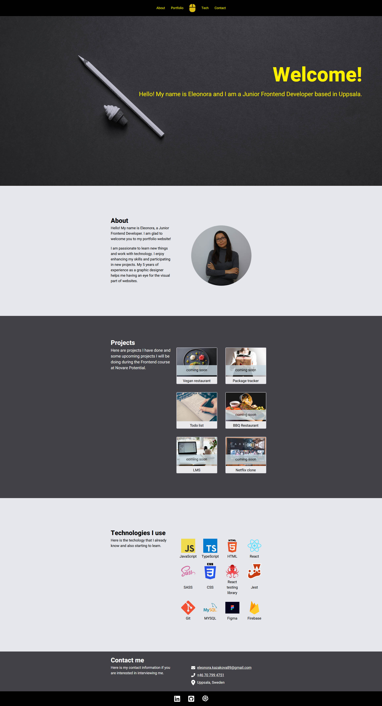

# Portfolio. Intensive Frontend Course by Novare Potential

### Description

In this project I use React Hooks:

- useState
- ReactDOM
- ExternalLink

The user can press on buttons from menu and scroll to a specific section.

The user can scroll up the page if he presses on a logo.

The user can open the project in 'Portfolio' section if the project doesn't have mark 'coming soon'.

```
npm start
```

## Open the site by terminal

http://localhost:3000/

## Public address

https://portfolio-814cf.web.app/

### `npm run build`

Builds the app for production to the `build` folder.


